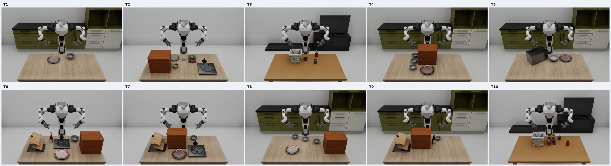

# Lightwheel RB-Y1 Transfer

Lightwheel의 **Lightwheel-Tasks-X7S에서 선정한 LIBERO task 10개를 RB-Y1 로봇용 Isaac Sim 환경으로 구성**한 프로젝트입니다. T1~T10 장면 실행, 양팔 키보드 조작, 원본 기준의 자동 성공 판정, LeRobot 형식의 시연 데이터 수집을 지원합니다.

- RB-Y1 모델: `rby1_ready_reach_table.usd`
- 작업대 높이: **0.72m**
- 조작: IsaacLab의 SE(3) 키보드 입력과 Differential IK
- 저장: **LeRobot v3** (`data/`, `meta/`, `videos/`) 및 검증용 원시 기록
- 성공 판정: 고정된 LW-BenchHub 코드에 기반한 `success_original`

현재 장면은 원본 task의 의미를 유지하도록 구성한 고정 배치 환경입니다. 원본 X7S episode를 그대로 복원한 환경이나, X7S 시연을 RB-Y1으로 리매핑 완료한 데이터셋을 제공하는 것은 아닙니다. 자동 성공 라벨과 별개로 시연의 실제 파지·배치 품질은 확인해야 합니다.

## T1~T10 환경

아래는 각 환경의 초기 정면 뷰입니다. **윗줄 T1~T5, 아랫줄 T6~T10** 순서이며, 환경 실행과 키보드 수집의 기본 뷰도 이 카메라를 사용합니다.



| Task | 작업 | LIBERO 레이아웃 | 개별 이미지 |
|---|---|---|---|
| T1 | 검은 그릇을 접시에 놓기 | libero-1-1 | [T1](docs/images/T01_front.jpg) |
| T2 | 쿠키 상자 위의 검은 그릇을 접시에 놓기 | libero-8-8 | [T2](docs/images/T02_front.jpg) |
| T3 | 케첩을 바구니에 넣기 | libero-2-2 | [T3](docs/images/T03_front.jpg) |
| T4 | 수납장의 위 서랍 열기 | libero-1-1 | [T4](docs/images/T04_front.jpg) |
| T5 | 전자레인지 문 열기 | libero-1-1 | [T5](docs/images/T05_front.jpg) |
| T6 | 스토브 켜기 | libero-8-8 | [T6](docs/images/T06_front.jpg) |
| T7 | 위 서랍을 열고 그릇 넣기 | libero-8-8 | [T7](docs/images/T07_front.jpg) |
| T8 | 가운데 검은 그릇을 뒤쪽 검은 그릇 위에 쌓기 | libero-1-1 | [T8](docs/images/T08_front.jpg) |
| T9 | 검은 그릇을 아래 서랍에 넣고 닫기 | libero-1-1 | [T9](docs/images/T09_front.jpg) |
| T10 | 알파벳 수프와 토마토 소스를 바구니에 넣기 | libero-2-2 | [T10](docs/images/T10_front.jpg) |

원본 언어 명령과 선정 역할은 [selected_tasks.csv](selected_tasks.csv), 상세 정보는 [selection.json](selection.json)에 있습니다. 정면 미리보기 카메라는 수집용 헤드·손목 카메라와 별도입니다.

## 실행 환경과 경로 설정

검증에 사용한 환경은 **Isaac Sim 5.1.0 / IsaacLab 2.3.0 / Python 3.11**입니다. 실행 Python에 IsaacLab, LeRobot, Pinocchio, PyTorch, NumPy, SciPy, Pillow, PyAV 등 필요한 패키지가 설치되어 있어야 합니다. 이 저장소만으로 외부 시뮬레이터와 에셋이 설치되지는 않습니다.

기본 폴더 구성은 다음과 같습니다.

```text
작업폴더/
├── lightwheel_rby1_transfer/
├── IsaacLab_RS/
├── rby1-sim-isaac/
│   └── assets/generated/rby1_ready_reach_table.usd
├── lerobot/
└── lw_benchhub/                  # 원본 분석·리매핑 도구 사용 시

~/.cache/lightwheel_sdk/          # 장면·물체·재질 에셋
~/datasets/                      # 기본 데이터 저장 위치
```

다른 위치에 설치했다면 필요한 환경변수만 지정합니다. Lightwheel 에셋의 하위 폴더와 텍스처 구조도 유지해야 합니다.

```bash
conda activate lerobot-arena
cd /path/to/lightwheel_rby1_transfer

# 기본 위치와 다를 때만 설정
export RBY1_ISAACLAB_ROOT="/path/to/IsaacLab_RS"
export RBY1_SIM_ROOT="/path/to/rby1-sim-isaac"
export RBY1_LIGHTWHEEL_CACHE="/path/to/lightwheel_sdk"
export RBY1_DATASETS_ROOT="$HOME/datasets"

# 현재 경로 출력 및 외부 에셋 링크 준비
./run_python.sh scripts/project_paths.py
```

공통 상위 경로는 `RBY1_REPOS_ROOT`로 지정할 수 있습니다. Python을 직접 선택하려면 `RBY1_PYTHON=/path/to/env/bin/python`을 설정합니다. 실행기는 활성 Conda 환경(base 제외) 또는 virtualenv를 우선 사용하며, 둘 다 없으면 로컬 `~/miniforge3/envs/lerobot-arena`를 찾습니다. 전체 경로 설정은 [project_paths.py](scripts/project_paths.py)를 참고하십시오.

외부 에셋은 프로젝트의 `.assets/` 심볼릭 링크로 연결됩니다. 이 링크는 각 PC에서 생성하는 로컬 설정이며, 원본 에셋을 프로젝트에 복사하지 않습니다.

## 키보드 데이터 수집

### 1. 실행

```bash
conda activate lerobot-arena
cd /path/to/lightwheel_rby1_transfer
./collect_keyboard.sh --task T1
```

`--task`를 `T2`~`T10`으로 바꾸면 해당 환경을 실행합니다. 출력 위치나 프레임률을 지정할 수도 있습니다.

```bash
./collect_keyboard.sh --task T1 \
  --output "$HOME/datasets/RBY1-T1-Keyboard" \
  --fps 50
```

기본 수집 설정은 **50fps, 카메라별 640×480**입니다. `--fps`는 10, 20, 25, 50을 지원합니다. 일반 키보드 수집은 GUI에서 진행합니다.

에피소드 최대 기록 시간은 Task에 따라 자동으로 적용됩니다.

| Task | 기본 최대 시간 |
|---|---:|
| T1, T2, T5, T6, T8 | 60초 |
| T4 | 90초 |
| T3, T7, T9 | 120초 |
| T10 | 150초 |

`B`로 기록을 시작한 이후의 **기록 프레임 수 / fps** 기준이며, 실제 벽시계 시간과 다를 수 있습니다. 기록 전 대기, `P` 일시정지, 저장·변환 시간은 포함하지 않습니다. 화면에 기록 시간과 제한 시간이 표시됩니다.

성공하면 즉시 저장합니다. **제한 시간까지 성공하지 못하면 해당 기록을 자동 폐기하고 장면을 초기화합니다.** 다음 시도는 `B`를 눌러 시작합니다. 마지막 허용 프레임에서 성공이 기록되면 저장을 우선합니다.

양의 정수 초 단위로 제한 시간을 변경할 수 있습니다. 예를 들어 T1을 90초로 설정하려면:

```bash
./collect_keyboard.sh --task T1 --max-episode-seconds 90
```

기본값은 X7S 원본 Task별 에피소드 길이의 P95에 3배 여유를 주고 30초 단위로 올림하되 최소 60초를 적용한 초기 수집 설정입니다. RB-Y1 키보드 시연의 실제 소요 시간을 확인하며 조정하십시오.

### 2. 조작

시뮬레이션 뷰포트를 클릭해 키보드 포커스를 둡니다. 처음 선택된 팔은 **왼팔**이며, 이동 축은 **로봇 기준 좌표계**입니다. 정면 화면에서 보이는 좌우와 로봇의 좌우는 반대일 수 있습니다.

| 키 | 기능 |
|---|---|
| `W` / `S` | 선택한 팔의 전진 / 후진 (x축) |
| `A` / `D` | 왼쪽 / 오른쪽 이동 (y축) |
| `Q` / `E` | 위 / 아래 이동 (z축) |
| `Z` / `X` | x축 회전 |
| `T` / `G` | y축 회전 |
| `C` / `V` | z축 회전 |
| `K` | 선택한 팔의 그리퍼 열기 / 닫기 |
| `Tab` | 왼팔 / 오른팔 전환 |
| `B` | 현재 상태에서 기록 시작 |
| `P` | 시뮬레이션·기록 일시정지 / 재개 |
| `L` | 이동 입력 해제 및 현재 관절 위치 유지 |
| `Enter` | 성공 조건을 충족한 기록 저장 요청 |
| `R` / `Backspace` | 저장 전 기록 폐기 및 장면 초기화 |
| `Esc` | 종료; 저장 전 기록은 폐기 |

### 3. 기록과 저장

1. 초기 장면과 선택된 팔을 확인하고 **`B`**를 눌러 기록을 시작합니다. 전체 작업을 담으려면 물체 조작 전에 시작합니다.
2. 팔과 그리퍼를 조작해 언어 명령을 수행합니다. 필요하면 `Tab`으로 팔을 전환합니다.
3. **`success_original`이 참이 되고 최소 2프레임이 기록되면 자동 저장**됩니다. 성공하지 않은 기록은 `Enter`로 강제 저장할 수 없습니다.
4. raw 저장과 LeRobot 변환이 끝나면 `Saved episode`가 출력되고 장면이 초기화됩니다. 다음 시연은 다시 `B`를 눌러 시작합니다.
5. 실패한 시도는 `R` 또는 `Backspace`로 폐기하고 다시 시작합니다. 저장 완료 후 `Esc`로 종료합니다.

`success_original`은 [scripts/vendor](scripts/vendor)의 고정된 LW-BenchHub 성공 판정 코드와 RB-Y1 상태 어댑터를 사용합니다. 원본 판정식에 포함되지 않은 파지 안정성이나 전체 동작 품질까지 보장하는 지표는 아닙니다. `--smoke-test` 계열 옵션은 개발 검증용이며 실제 시연 수집에 사용하지 않습니다.

### 4. 저장 데이터

T1 기본 출력은 다음과 같습니다. `RBY1_DATASETS_ROOT` 또는 `--output`으로 위치를 변경할 수 있습니다.

```text
~/datasets/
├── Lightwheel-Tasks-RBY1-T1-Keyboard-Original/
│   ├── data/                   # 상태, action, 시간, 성공 라벨
│   ├── meta/                   # LeRobot 메타데이터와 episode 매핑
│   └── videos/                 # 헤드·왼손·오른손 카메라 영상
└── Lightwheel-Tasks-RBY1-T1-Keyboard-Original_raw/
    ├── episode-.../             # PNG, trajectory.npz, 성공 판정 상태 기록 등
    └── export.log
```

`observation.state`와 `action`은 각각 **18차원**입니다. 양팔 14개 관절의 각도(rad)와 손가락 4개 관절의 변위(m)를 사용하며, action은 시뮬레이터에 보낸 절대 관절 위치 목표입니다. 실제 RB-Y1 드라이버에 바로 전달하는 명령 형식과는 다릅니다.

기존 출력 폴더에는 task·fps·영상 크기·데이터 스키마가 호환되는 경우에만 추가 수집할 수 있습니다. 변환 오류가 나면 raw 기록을 보존하고 `export.log`를 확인하십시오.

수집 후 LeRobot 로딩, 원시 기록과의 일치, 영상 프레임·시간 및 성공 판정 재연산을 검사하려면 다음 명령을 사용합니다. 이 검증에는 `_raw` 기록도 필요합니다.

```bash
./run_python.sh scripts/validate_keyboard_dataset.py \
  --root "$HOME/datasets/Lightwheel-Tasks-RBY1-T1-Keyboard-Original"
```

## 장면만 실행하기

```bash
./run_python.sh scripts/run_environment.py --task T1
```

이 명령은 준비 자세를 유지하며 장면과 성공 판정을 확인합니다. 키보드로 팔을 조작하고 데이터를 수집하려면 `collect_keyboard.sh`를 사용하십시오.

## 주요 파일

| 경로 | 내용 |
|---|---|
| `environments/T01.usd`~`T10.usd` | RB-Y1 task 장면 |
| `environments/T01.json`~`T10.json` | 물체, 배치, 로봇 자세 정보 |
| `scripts/collect_keyboard.py` | 키보드 조작·기록·자동 저장 |
| `scripts/export_keyboard_episode.py` | LeRobot 변환 |
| `scripts/success_original.py` | 원본 성공 판정 어댑터 |
| `scripts/front_camera.py` | 기본 정면 카메라 설정 |
| `docs/images/` | README용 T1~T10 이미지 |

이미지는 Isaac Sim의 초기 장면 렌더이며 성공 시연을 나타내지 않습니다. 다음 명령으로 원본 PNG와 합본을 다시 생성할 수 있습니다. 출력 위치는 `reports/front_views/`입니다.

```bash
./run_python.sh scripts/render_front_views.py
./run_python.sh scripts/compose_front_views.py
```

원본 성공 판정 코드의 출처·커밋은 [source_manifest.json](scripts/vendor/source_manifest.json), 해당 라이선스는 [scripts/vendor/LICENSE](scripts/vendor/LICENSE)에 보존되어 있습니다.
